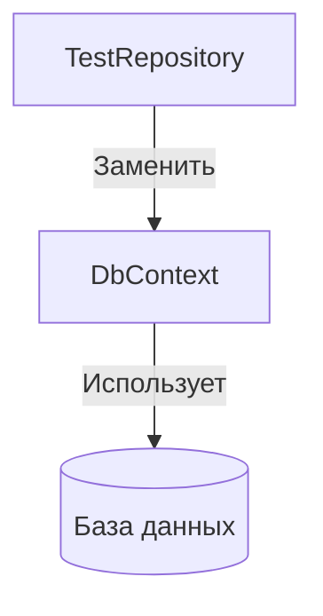
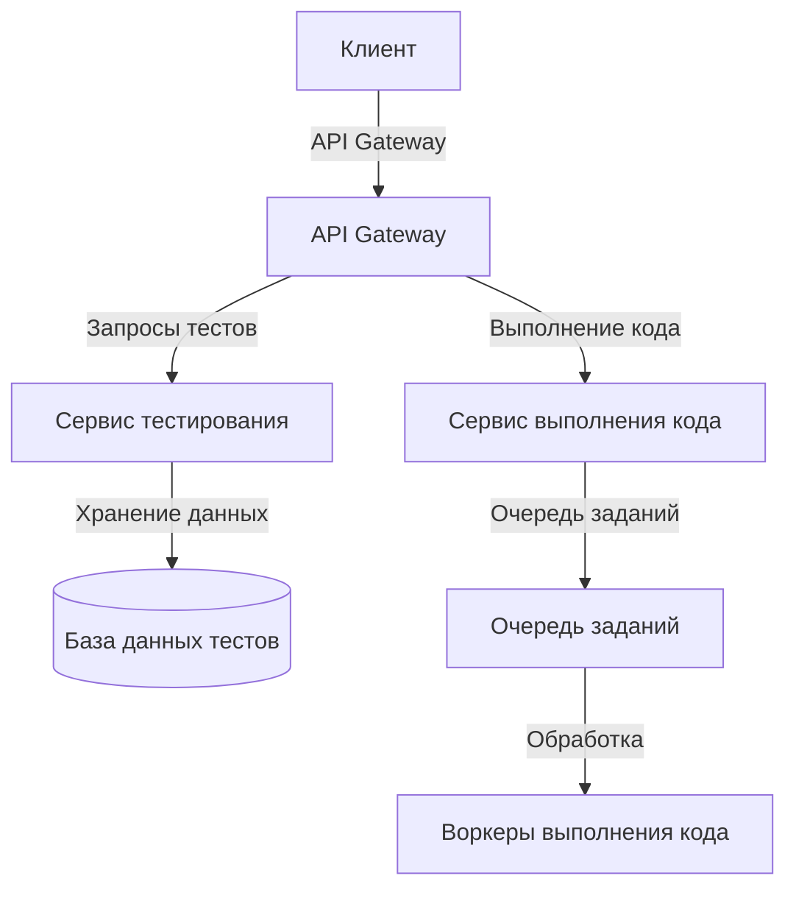

# Анализ архитектуры и рекомендации по улучшению

## Текущая архитектура

Текущая архитектура приложения представляет собой монолитное веб-приложение на базе ASP.NET Core с клиентской частью на React. Основные компоненты:

1. **Клиентская часть (React)**
   - Страницы для прохождения тестов и выполнения заданий по программированию
   - Взаимодействие с API через HTTP-запросы

2. **Серверная часть (ASP.NET Core)**
   - API-контроллеры для обработки запросов
   - Сервисы для бизнес-логики
   - Репозитории для доступа к данным
   - Механизм компиляции и выполнения кода в изолированной среде

3. **Хранение данных**
   - In-memory хранилище тестов и заданий (без использования базы данных)

## Сильные стороны текущей архитектуры

1. **Изоляция выполнения кода**
   - Использование `AssemblyLoadContext` для безопасного выполнения пользовательского кода
   - Перехват стандартного вывода для анализа результатов

2. **Разделение ответственности**
   - Разделение на контроллеры, сервисы и репозитории
   - Использование интерфейсов для абстракции зависимостей

3. **Современный стек технологий**
   - ASP.NET Core для серверной части
   - React для клиентской части
   - Roslyn для компиляции кода

## Слабые стороны и рекомендации по улучшению

### 1. Хранение данных

**Проблема:** Данные хранятся в памяти и жестко закодированы в коде.

**Рекомендации:**
- Внедрить постоянное хранилище данных (SQL Server, PostgreSQL)
- Создать миграции для управления схемой базы данных
- Реализовать репозитории для работы с базой данных



### 2. Архитектурные паттерны

**Проблема:** Недостаточное разделение слоев приложения.

**Рекомендации:**
- Внедрить Clean Architecture или Onion Architecture
- Выделить слои Domain, Application, Infrastructure, Presentation
- Использовать CQRS для разделения операций чтения и записи

```mermaid
layeredArchitecture TD
    title Предлагаемая архитектура
    
    layer Presentation {
        component SPA["SPA (React)"]
        component API["API Controllers"]
    }
    
    layer Application {
        component Commands["Commands"]
        component Queries["Queries"]
        component Services["Services"]
    }
    
    layer Domain {
        component Entities["Entities"]
        component ValueObjects["Value Objects"]
        component DomainServices["Domain Services"]
    }
    
    layer Infrastructure {
        component Persistence["Persistence"]
        component CodeExecution["Code Execution"]
        component ExternalServices["External Services"]
    }
    
    Presentation --> Application
    Application --> Domain
    Application --> Infrastructure
    Infrastructure --> Domain
```

### 3. Безопасность

**Проблема:** Отсутствие аутентификации и авторизации, недостаточная защита от вредоносного кода.

**Рекомендации:**
- Внедрить Identity Server или ASP.NET Core Identity
- Реализовать JWT-аутентификацию
- Усилить изоляцию выполнения кода (контейнеризация, ограничение ресурсов)
- Добавить проверку на вредоносный код

### 4. Масштабируемость

**Проблема:** Монолитная архитектура ограничивает масштабируемость.

**Рекомендации:**
- Разделить на микросервисы (сервис тестирования, сервис выполнения кода)
- Внедрить очереди сообщений для асинхронной обработки
- Использовать кэширование для часто запрашиваемых данных



### 5. Тестирование

**Проблема:** Отсутствие автоматизированных тестов.

**Рекомендации:**
- Добавить модульные тесты для бизнес-логики
- Внедрить интеграционные тесты для API
- Реализовать E2E-тесты для пользовательских сценариев

### 6. Мониторинг и логирование

**Проблема:** Отсутствие системы мониторинга и логирования.

**Рекомендации:**
- Внедрить структурированное логирование (Serilog, NLog)
- Добавить мониторинг производительности (Application Insights, Prometheus)
- Реализовать трассировку запросов (OpenTelemetry)

### 7. Инфраструктура как код

**Проблема:** Отсутствие автоматизации развертывания.

**Рекомендации:**
- Контейнеризация приложения (Docker)
- Оркестрация контейнеров (Kubernetes, Docker Compose)
- CI/CD-пайплайны для автоматического развертывания

```mermaid
deploymentDiagram
    title Предлагаемая инфраструктура
    
    Deployment_Node(client, "Клиент", "Браузер") {
        Container(spa, "SPA", "React")
    }
    
    Deployment_Node(cloud, "Облачная инфраструктура", "Azure/AWS") {
        Deployment_Node(gateway, "API Gateway", "") {
            Container(apiGateway, "API Gateway", "")
        }
        
        Deployment_Node(testService, "Сервис тестирования", "Kubernetes Pod") {
            Container(testApi, "Test API", "ASP.NET Core")
        }
        
        Deployment_Node(codeService, "Сервис выполнения кода", "Kubernetes Pod") {
            Container(codeApi, "Code Execution API", "ASP.NET Core")
        }
        
        Deployment_Node(workers, "Воркеры", "Kubernetes Pod") {
            Container(codeWorkers, "Code Execution Workers", "Docker")
        }
        
        Deployment_Node(database, "База данных", "") {
            Container(db, "SQL Database", "")
        }
        
        Deployment_Node(queue, "Очередь сообщений", "") {
            Container(mq, "Message Queue", "RabbitMQ/Kafka")
        }
        
        Deployment_Node(monitoring, "Мониторинг", "") {
            Container(logs, "Logs", "ELK Stack")
            Container(metrics, "Metrics", "Prometheus/Grafana")
        }
    }
    
    Rel(client, gateway, "HTTPS")
    Rel(gateway, testService, "HTTPS")
    Rel(gateway, codeService, "HTTPS")
    Rel(testService, database, "SQL")
    Rel(codeService, queue, "AMQP")
    Rel(queue, workers, "AMQP")
    Rel(workers, database, "SQL")
    Rel_Back(testService, monitoring, "Logs/Metrics")
    Rel_Back(codeService, monitoring, "Logs/Metrics")
    Rel_Back(workers, monitoring, "Logs/Metrics")
```

## Поэтапный план миграции

1. **Этап 1: Рефакторинг существующего кода**
   - Внедрение чистой архитектуры
   - Добавление модульных тестов
   - Улучшение изоляции выполнения кода

2. **Этап 2: Внедрение постоянного хранилища данных**
   - Создание схемы базы данных
   - Реализация репозиториев для работы с базой данных
   - Миграция данных из in-memory хранилища

3. **Этап 3: Улучшение безопасности**
   - Внедрение аутентификации и авторизации
   - Усиление изоляции выполнения кода
   - Добавление проверки на вредоносный код

4. **Этап 4: Разделение на микросервисы**
   - Выделение сервиса тестирования
   - Выделение сервиса выполнения кода
   - Внедрение API Gateway

5. **Этап 5: Инфраструктура и DevOps**
   - Контейнеризация приложения
   - Настройка CI/CD-пайплайнов
   - Внедрение мониторинга и логирования

## Заключение

Текущая архитектура приложения имеет хорошую основу, но требует улучшений для обеспечения масштабируемости, безопасности и поддерживаемости. Предложенные рекомендации позволят создать более надежную и гибкую систему, которая будет соответствовать современным требованиям к веб-приложениям.