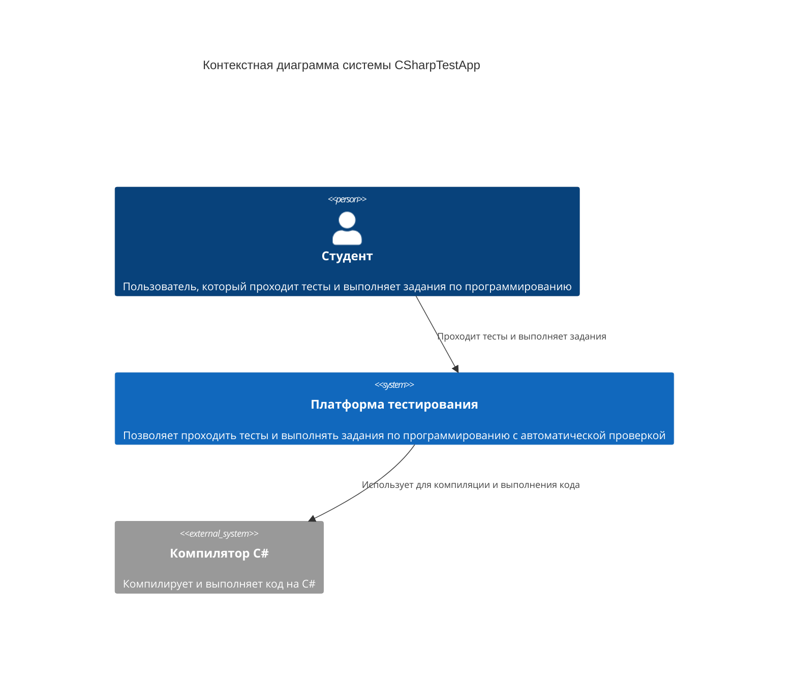
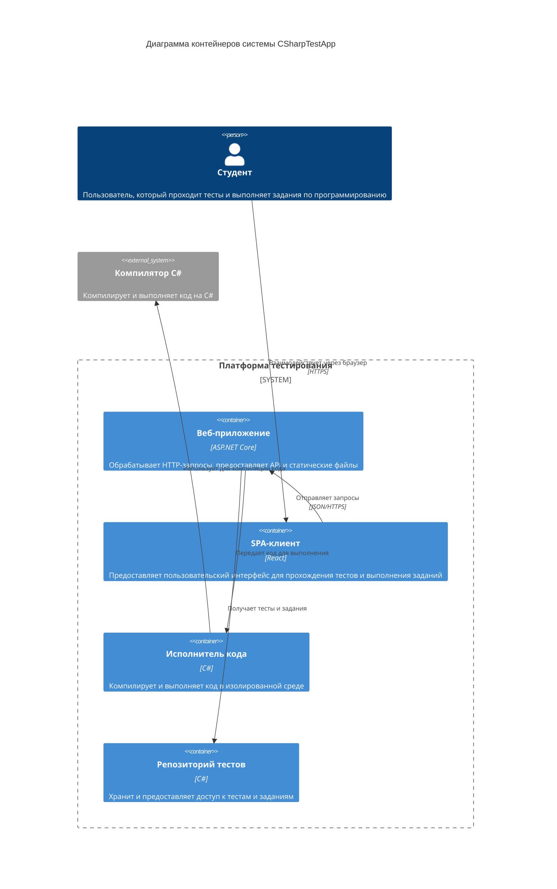
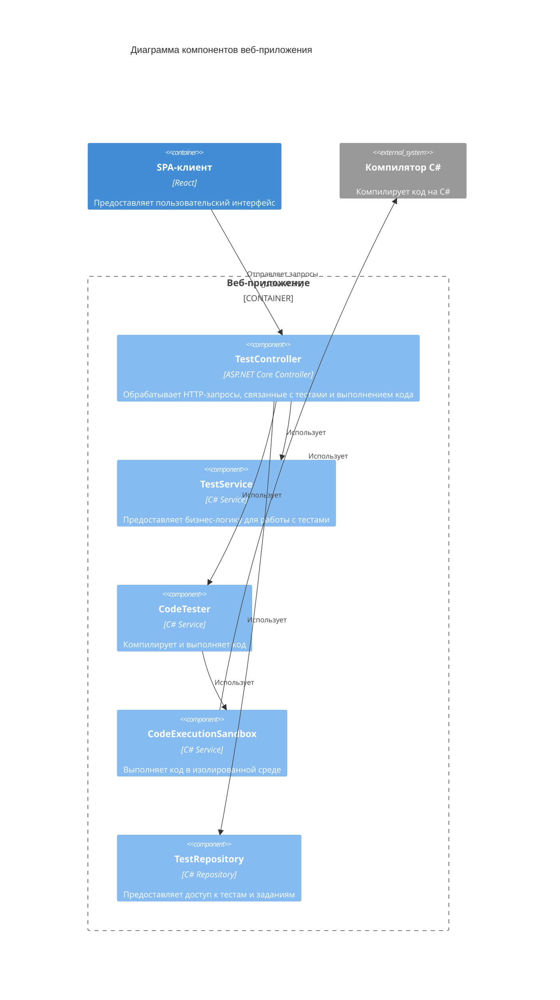
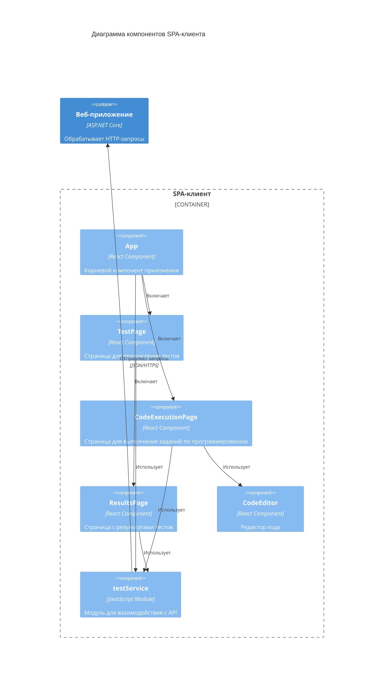

# Архитектура проекта CSharpTestApp (C4 модель)

## Контекстная диаграмма (C1)



## Диаграмма контейнеров (C2)



## Диаграмма компонентов (C3) - Веб-приложение



## Диаграмма компонентов (C3) - SPA-клиент



## Диаграмма кода (C4) - CodeTester и CodeExecutionSandbox

```mermaid
C4Code
    title Диаграмма кода компонентов CodeTester и CodeExecutionSandbox

    Component_Boundary(codeTester, "CodeTester") {
        Class(iCodeTester, "ICodeTester", "Interface", "Интерфейс для компиляции и выполнения кода")
        Class(codeTesterImpl, "CodeTester", "Class", "Реализация интерфейса ICodeTester")
        Class(compilationResult, "CompilationResult", "Class", "Результат компиляции кода")
        Class(testRunResult, "TestRunResult", "Class", "Результат выполнения тестов")
    }

    Component_Boundary(sandbox, "CodeExecutionSandbox") {
        Class(sandboxClass, "CodeExecutionSandbox", "Class", "Изолированная среда для выполнения кода")
        Class(remoteExecutor, "RemoteExecutor", "Class", "Выполняет тесты в изолированной среде")
    }

    Component_Boundary(models, "Models") {
        Class(unitTest, "UnitTest", "Class", "Модель юнит-теста")
    }

    Rel(iCodeTester, codeTesterImpl, "Реализуется")
    Rel(codeTesterImpl, compilationResult, "Создает")
    Rel(codeTesterImpl, testRunResult, "Возвращает")
    Rel(codeTesterImpl, sandboxClass, "Использует")
    Rel(sandboxClass, remoteExecutor, "Создает")
    Rel(remoteExecutor, unitTest, "Использует")
    Rel(remoteExecutor, testRunResult, "Возвращает")
```