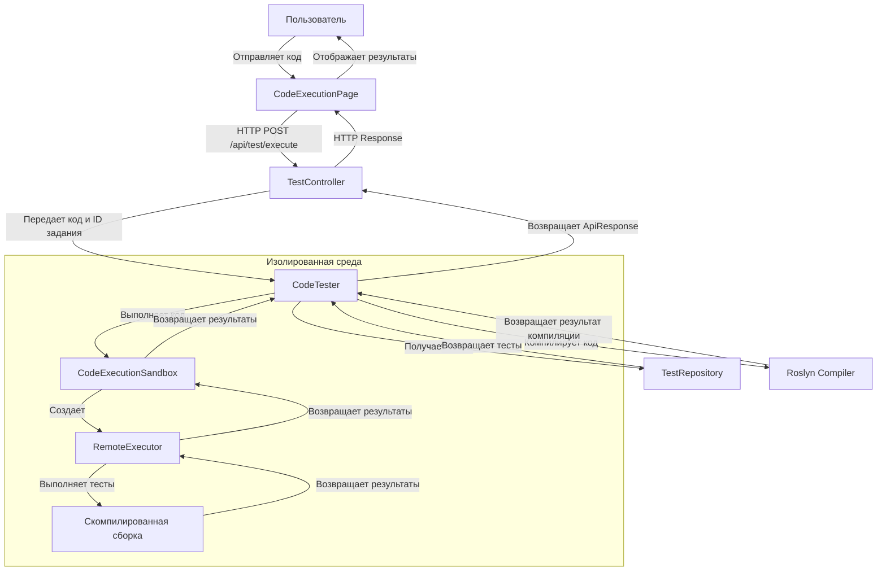
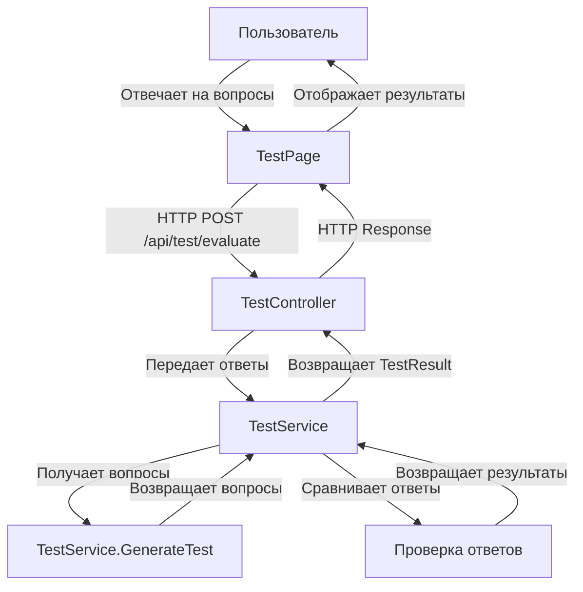
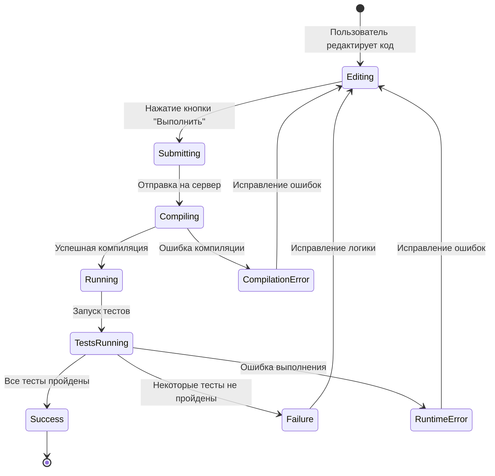
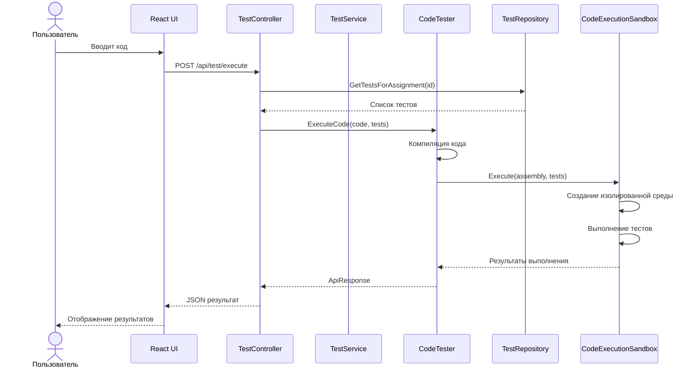

# Диаграммы потоков данных

## Поток данных при выполнении кода



## Поток данных при прохождении тестов



## Архитектурные слои системы

```mermaid
layeredArchitecture TD
    title Архитектурные слои системы
    
    layer Presentation {
        component SPA["SPA (React)"]
        component API["API Controllers"]
    }
    
    layer BusinessLogic {
        component Services["Services"]
        component CodeExecution["Code Execution"]
    }
    
    layer DataAccess {
        component Repositories["Repositories"]
    }
    
    layer Infrastructure {
        component Sandbox["Sandbox Environment"]
        component Compiler["Roslyn Compiler"]
    }
    
    Presentation --> BusinessLogic
    BusinessLogic --> DataAccess
    BusinessLogic --> Infrastructure
```

## Диаграмма состояний для выполнения кода



## Диаграмма развертывания

```mermaid
deploymentDiagram
    title Диаграмма развертывания
    
    Deployment_Node(client, "Клиент", "Браузер") {
        Container(spa, "SPA", "React")
    }
    
    Deployment_Node(server, "Сервер", "Windows/Linux") {
        Deployment_Node(webServer, "Веб-сервер", "ASP.NET Core") {
            Container(api, "API", "ASP.NET Core")
            Container(staticFiles, "Статические файлы", "HTML/JS/CSS")
        }
        
        Deployment_Node(appServer, "Сервер приложений", "ASP.NET Core") {
            Container(services, "Сервисы", "C#")
            Container(sandbox, "Песочница", "AssemblyLoadContext")
        }
        
        Deployment_Node(inMemory, "In-Memory Storage", "") {
            Container(testRepo, "Репозиторий тестов", "Dictionary")
        }
    }
    
    Rel(client, webServer, "HTTPS")
    Rel(webServer, appServer, "Internal")
    Rel(appServer, inMemory, "Internal")
```

## Диаграмма взаимодействия компонентов

