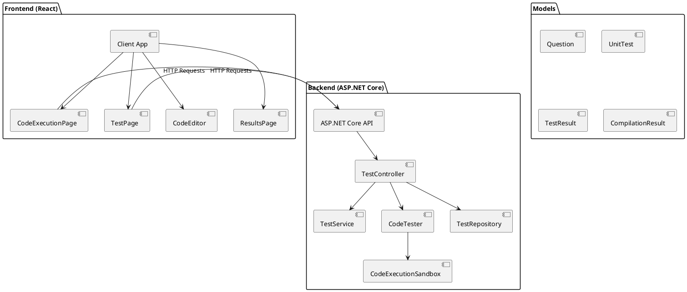
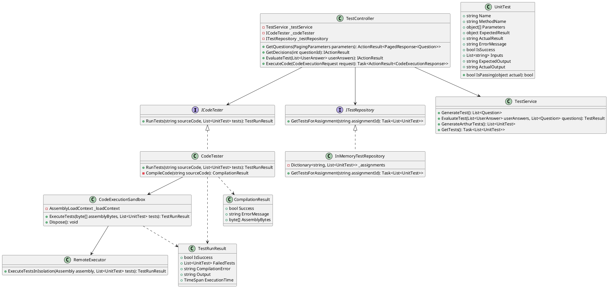
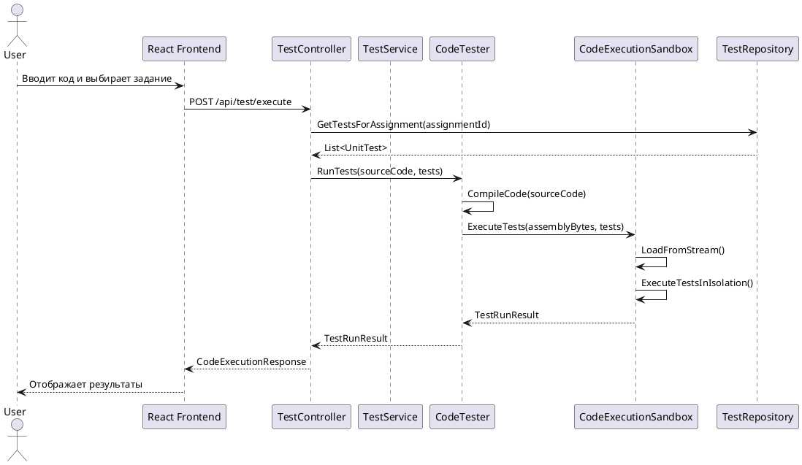
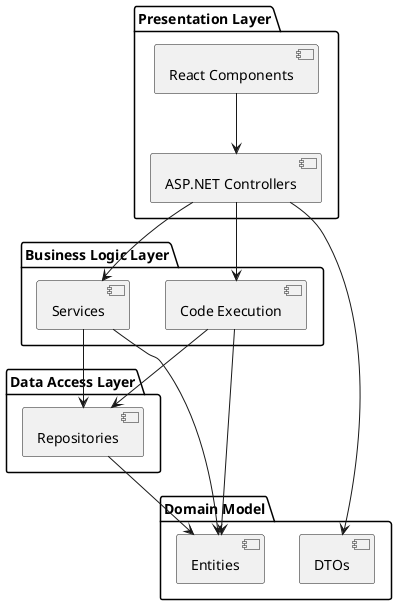
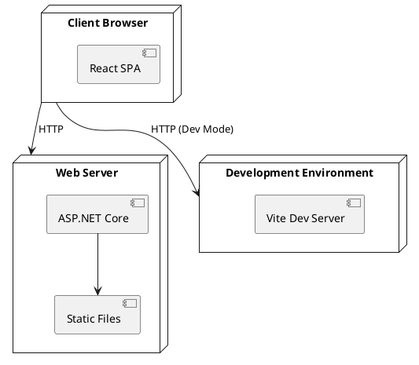
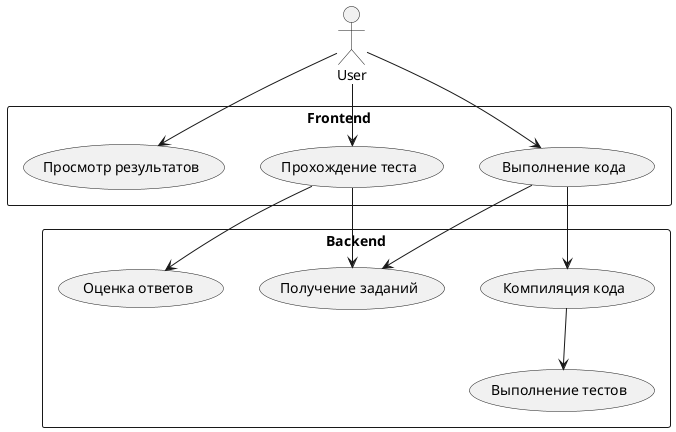

# Архитектура проекта CSharpTestApp (PlantUML)

## Компонентная диаграмма

## Диаграмма классов

## Диаграмма последовательности

## Архитектурные слои

## Развертывание

## Основные потоки данных

