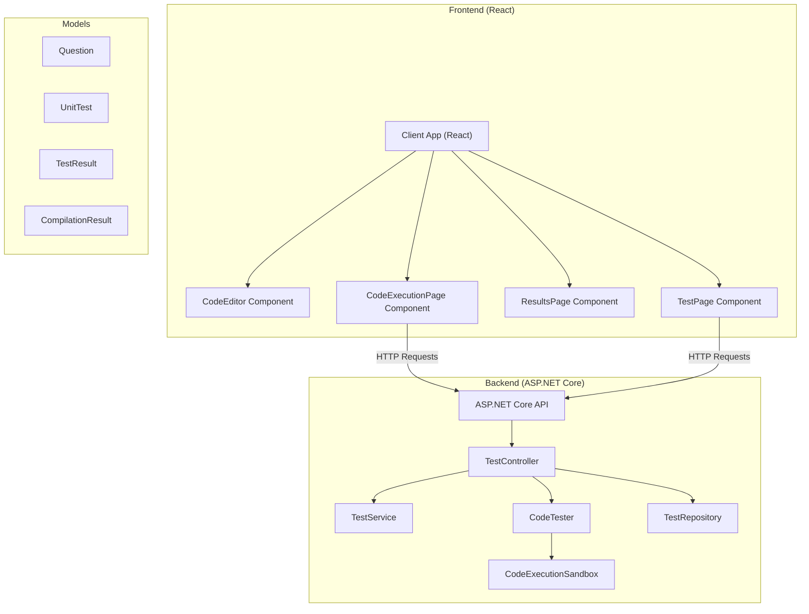
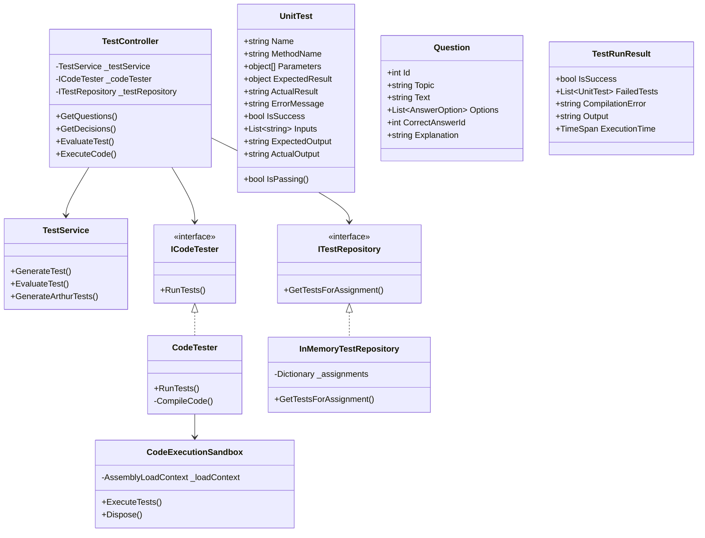
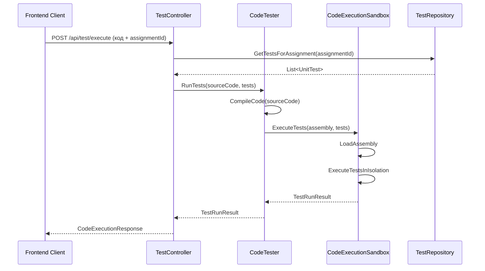

# Архитектура проекта CSharpTestApp

## Диаграмма компонентов

## Диаграмма классов

## Диаграмма последовательности выполнения кода

## Архитектурные особенности

1. **Клиент-серверная архитектура**:
   - Frontend: React приложение с компонентами для тестирования и выполнения кода
   - Backend: ASP.NET Core API с контроллерами, сервисами и репозиториями

2. **Слои приложения**:
   - Presentation Layer: React компоненты и ASP.NET Core контроллеры
   - Business Logic Layer: Сервисы (TestService, CodeTester)
   - Data Access Layer: Репозитории (InMemoryTestRepository)
   - Domain Model: Модели данных (Question, UnitTest, TestResult)

3. **Ключевые компоненты**:
   - **CodeTester**: Компиляция и выполнение C# кода
   - **CodeExecutionSandbox**: Изолированное выполнение скомпилированного кода
   - **TestService**: Генерация и оценка тестов
   - **TestRepository**: Хранение и получение тестовых данных

4. **Паттерны проектирования**:
   - Repository Pattern: ITestRepository и InMemoryTestRepository
   - Dependency Injection: Внедрение зависимостей через конструкторы
   - Strategy Pattern: Интерфейс ICodeTester и его реализация