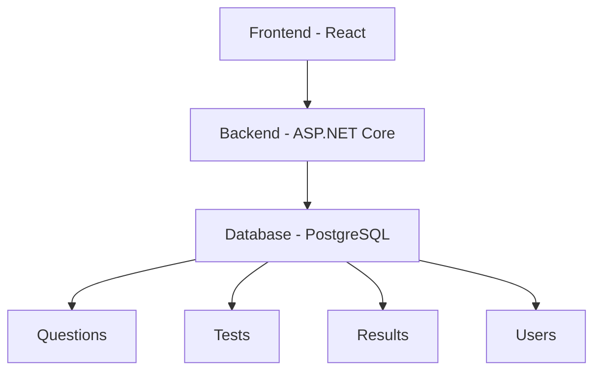
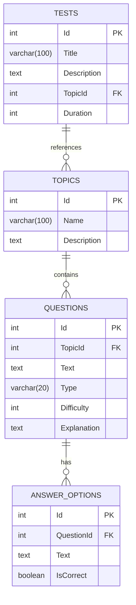
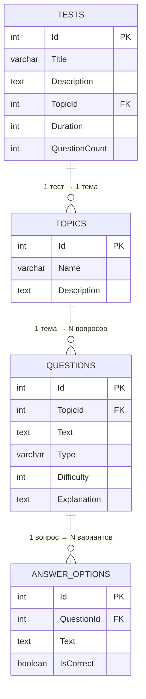

# Описание приложения: Универсальная платформа для тестирования знаний

## Обзор
**Universal Quiz Platform** - это гибкая система для создания и прохождения тестов по различным темам. Изначально разработанная для проверки знаний по C#, платформа эволюционировала в универсальное решение для образовательных учреждений, корпоративного обучения и самостоятельной проверки знаний.

## Ключевые возможности

### Для администраторов/преподавателей
- 🗃️ **Управление тестами через базу данных**
- 📚 **Создание тестов по любым темам**
- 🧩 **Гибкая настройка структуры вопросов**
- 📊 **Анализ результатов тестирования**
- 👥 **Управление пользователями и группами**

### Для пользователей/студентов
- 🚀 **Прохождение тестов в интуитивном интерфейсе**
- ⏱️ **Таймер и контроль времени**
- 📈 **Мгновенные результаты с детализацией**
- 📝 **История пройденных тестов**
- 🏆 **Система достижений и рейтингов**

## Техническая архитектура

### Основные компоненты системы

1. **Модуль администрирования**
   - Управление темами и категориями
   - Импорт/экспорт вопросов
   - Настройка параметров тестирования

2. **Движок тестирования**
   - Адаптивная генерация тестов
   - Система подсчета баллов
   - Обработка различных типов вопросов

3. **Аналитическая панель**
   - Визуализация результатов
   - Выявление слабых мест
   - Сравнение с группой

4. **Пользовательские профили**
   - Персональная статистика
   - Достижения и сертификаты
   - Настройка уведомлений

## База данных: Структура хранения вопросов
### Основные таблицы
**Таблица: Topics (Темы)**
| Столбец       | Тип         | Описание                |
|---------------|-------------|-------------------------|
| Id            | INT (PK)    | Уникальный идентификатор|
| Name          | VARCHAR(100)| Название темы          |
| Description   | TEXT        | Описание темы          |
**Таблица: Questions (Вопросы)**
| Столбец       | Тип          | Описание                     |
|---------------|--------------|------------------------------|
| Id            | INT (PK)     | Уникальный идентификатор     |
| TopicId       | INT (FK)     | Ссылка на тему               |
| Text          | TEXT         | Текст вопроса                |
| Type          | VARCHAR(20)  | Тип вопроса (single/multiple)|
| Difficulty    | INT          | Сложность (1-5)              |
| Explanation   | TEXT         | Пояснение к ответу           |
**Таблица: AnswerOptions (Варианты ответов)**
| Столбец       | Тип         | Описание                |
|---------------|-------------|-------------------------|
| Id            | INT (PK)    | Уникальный идентификатор|
| QuestionId    | INT (FK)    | Ссылка на вопрос        |
| Text          | TEXT        | Текст варианта ответа   |
| IsCorrect     | BOOLEAN     | Правильный ответ        |
**Таблица: Tests (Тесты)**
| Столбец       | Тип         | Описание                      |
|---------------|-------------|-------------------------------|
| Id            | INT (PK)    | Уникальный идентификатор      |
| Title         | VARCHAR(100)| Название теста                |
| Description   | TEXT        | Описание теста                |
| TopicId       | INT (FK)    | Основная тема теста           |
| Duration      | INT         | Время на прохождение (минуты) |
_______________________________________________________________

###Взаимосвязи таблиц

//TODO Features :

Builder

Вот подробное описание бизнес-функций, которые можно добавить в ваш проект, с указанием того, как они могут использовать минимум 10 основных паттернов проектирования:

### 1. Система управления пользователями и ролями (User and Role Management System)
Описание: Внедрение полноценной системы аутентификации и авторизации, позволяющей регистрировать пользователей, назначать им различные роли (например, студент, преподаватель, администратор) и управлять их доступом к функциям платформы.

Паттерны проектирования:

- Singleton (Одиночка): Для централизованного управления конфигурацией системы аутентификации или для единственного экземпляра AuthenticationService .
- Strategy (Стратегия): Для различных методов аутентификации (например, по логину/паролю, через OAuth, по токену). Каждый метод аутентификации будет отдельной стратегией.
- Observer (Наблюдатель): Для уведомления других частей системы (например, логирования, аналитики) о событиях, связанных с пользователями (регистрация, вход, изменение роли).
### 2. Расширенная система заданий и курсов (Advanced Assignment and Course System)
Описание: Создание возможности для преподавателей формировать курсы, добавлять в них структурированные задания (с различными типами: кодовые, тестовые, с открытым ответом), устанавливать сроки сдачи и критерии оценки.

Паттерны проектирования:

- Composite (Компоновщик): Для представления иерархической структуры курсов, модулей и заданий. Курс может содержать модули, а модули — задания, при этом все они могут обрабатываться единообразно.
- Factory Method (Фабричный метод): Для создания различных типов заданий (кодовые, тестовые, с открытым ответом) без привязки к конкретным классам заданий.
- Builder (Строитель): Для пошагового конструирования сложных объектов заданий, которые могут иметь множество опциональных полей (например, сроки, критерии, примеры ввода/вывода).
### 3. Система обратной связи и рецензирования кода (Code Review and Feedback System)
Описание: Позволяет преподавателям оставлять комментарии к коду студентов, предлагать исправления, а студентам — просматривать эту обратную связь и вносить изменения. Возможность peer-review.

Паттерны проектирования:

- Command (Команда): Для инкапсуляции операций, связанных с обратной связью (добавить комментарий, удалить комментарий, пометить как решенное). Это позволит легко отменять/повторять действия и вести историю изменений.
- Memento (Снимок): Для сохранения состояний кода или комментариев, чтобы можно было откатиться к предыдущим версиям или просматривать историю изменений.
### 4. Модуль аналитики и отчетности (Analytics and Reporting Module)
Описание: Сбор и анализ данных о прогрессе студентов, частоте ошибок, популярных заданиях, эффективности тестов. Генерация отчетов для преподавателей и администраторов.

Паттерны проектирования:

- Facade (Фасад): Для предоставления упрощенного интерфейса к сложной подсистеме сбора и обработки аналитических данных.
- Iterator (Итератор): Для обхода коллекций данных (например, результатов тестов, активности пользователей) при генерации отчетов, не раскрывая их внутреннюю структуру.
### 5. Система уведомлений (Notification System)
Описание: Отправка уведомлений пользователям о важных событиях: сдача задания, получение обратной связи, приближение дедлайна, новые объявления.

Паттерны проектирования:
- Observer (Наблюдатель): Для подписки различных каналов уведомлений (email, push, in-app) на события в системе.
- Adapter (Адаптер): Для интеграции с различными сторонними сервисами отправки уведомлений (например, SendGrid, Firebase), которые имеют разные API.

### 6. Расширяемый механизм тестирования (Extensible Testing Engine)
Описание: Возможность добавления новых типов вопросов и логики их оценки без изменения основного кода движка тестирования.

Паттерны проектирования:

- Template Method (Шаблонный метод): Для определения скелета алгоритма тестирования, позволяя подклассам (конкретным типам тестов) переопределять определенные шаги, например, способ оценки ответа.
- Decorator (Декоратор): Для динамического добавления новой функциональности к существующим тестам (например, добавление подсказок, ограничение по времени на конкретный вопрос).

### 7. Система плагинов/расширений для IDE (IDE Plugin/Extension System)
Описание: Разработка плагинов для популярных IDE (VS Code, JetBrains IDEs) для синхронизации заданий, отправки кода на проверку и получения результатов прямо в редакторе.

Паттерны проектирования:

- Bridge (Мост): Для разделения абстракции (API плагина) от реализации (конкретные IDE-специфичные адаптеры), что позволяет независимо развивать обе части.
- Proxy (Заместитель): Для контроля доступа к ресурсам платформы из IDE или для отложенной инициализации тяжелых компонентов плагина.

### 8. Система кэширования результатов (Results Caching System)
Описание: Кэширование часто запрашиваемых данных (например, результатов тестов, списков вопросов), чтобы снизить нагрузку на базу данных и ускорить отклик системы.

Паттерны проектирования:

- Flyweight (Приспособленец): Для эффективного использования памяти при хранении большого количества однотипных объектов (например, результаты тестов с одинаковыми ответами).

### 9. Система управления конфигурацией (Configuration Management System)
Описание: Централизованное управление настройками приложения, такими как параметры подключения к базе данных, ключи API, настройки функциональности.

Паттерны проектирования:

- Singleton (Одиночка): Для обеспечения единственного экземпляра `ConfigurationManager`, который предоставляет доступ к настройкам из любой точки приложения.

### 10. Модуль мониторинга и логирования (Monitoring and Logging Module)
Описание: Сбор метрик производительности, отслеживание ошибок и ведение логов для анализа работы системы и своевременного выявления проблем.

Паттерны проектирования:

- Chain of Responsibility (Цепочка обязанностей): Для обработки логов различными обработчиками (например, запись в файл, отправка в систему мониторинга, вывод в консоль), где каждый обработчик решает, может ли он обработать данный лог.

### 11. Интеграция с внешними системами обучения (LMS Integration)
Описание: Возможность интеграции с популярными Learning Management Systems (LMS), такими как Moodle или Canvas, для синхронизации курсов, заданий и оценок.

Паттерны проектирования:

- Mediator (Посредник): Для управления сложным взаимодействием между вашей платформой и различными LMS. Посредник будет инкапсулировать логику синхронизации, уменьшая прямые связи между системами.

### 12. Система геймификации (Gamification System)
Описание: Введение игровых элементов, таких как значки (badges), очки опыта, уровни и доски лидеров, для повышения мотивации студентов.

Паттерны проектирования:

- State (Состояние): Для управления состоянием пользователя в системе геймификации (например, его уровень, прогресс до следующего уровня). Поведение объекта пользователя будет меняться в зависимости от его состояния.

### 13. Конструктор тестов с drag-and-drop (Drag-and-Drop Test Builder)
Описание: Визуальный конструктор, позволяющий преподавателям создавать тесты, перетаскивая вопросы из банка вопросов и настраивая их порядок и параметры.

Паттерны проектирования:

- Prototype (Прототип): Для клонирования вопросов из банка вопросов при добавлении их в тест. Это позволяет создавать новые экземпляры вопросов без необходимости создавать их с нуля.

### 14. Система адаптивного обучения (Adaptive Learning System)
Описание: Платформа анализирует ответы студента и автоматически подстраивает сложность и тип следующих вопросов, чтобы оптимизировать процесс обучения.

Паттерны проектирования:

- Abstract Factory (Абстрактная фабрика): Для создания семейств связанных объектов — вопросов разной сложности. В зависимости от успеваемости студента будет использоваться фабрика для легких, средних или сложных вопросов.

### 15. Локализация и интернационализация (Localization and Internationalization)
Описание: Поддержка нескольких языков для интерфейса и контента платформы.

Паттерны проектирования:

- Interpreter (Интерпретатор): Можно использовать для разбора и применения языковых правил или форматов строк для различных языков, хотя это и менее распространенное применение паттерна. Более классическим подходом будут ресурсные файлы, но для сложных правил форматирования (например, плюрализация) интерпретатор может быть полезен.

Паттерны проектирования:

- Observer (Наблюдатель): (Повторное использование) Для подписки различных каналов уведомлений (email, push-уведомления в приложении) на события в системе.
- Adapter (Адаптер): Для интеграции с различными сторонними сервисами отправки уведомлений (например, SendGrid для email, Firebase для push-уведомлений), предоставляя единый интерфейс.
### 6. Расширяемый механизм тестирования (Extensible Testing Mechanism)
Описание: Возможность добавления новых типов тестов (например, тесты производительности, тесты безопасности, тесты на основе регулярных выражений) без изменения основной логики CodeTester .

Паттерны проектирования:

- Template Method (Шаблонный метод): Для определения скелета алгоритма тестирования, позволяя подклассам переопределять определенные шаги (например, подготовка окружения, запуск теста, анализ результатов).
- Decorator (Декоратор): Для динамического добавления новой функциональности к существующим тестам (например, логирование, кэширование результатов, дополнительная валидация) без изменения их структуры.
### 7. Система плагинов/расширений для IDE (IDE Plugin/Extension System)
Описание: Предоставление API для создания плагинов, которые могут интегрироваться с внешними IDE (например, VS Code) для отправки кода, получения результатов тестов и обратной связи напрямую из среды разработки.

Паттерны проектирования:

- Bridge (Мост): Для разделения абстракции (API плагина) от реализации (конкретные IDE-специфичные адаптеры), позволяя им развиваться независимо.
- Proxy (Заместитель): Для контроля доступа к ресурсам или для отложенной инициализации (например, прокси для удаленного API IDE).
### 8. Система кэширования результатов (Result Caching System)
Описание: Кэширование результатов выполнения кода и тестов для часто запрашиваемых заданий или для предотвращения повторных вычислений при неизменном коде.

Паттерны проектирования:

- Flyweight (Приспособленец): Для эффективного использования памяти при хранении большого количества однотипных, но часто повторяющихся объектов (например, результатов тестов с одинаковыми входными данными).
### 9. Система управления конфигурацией (Configuration Management System)
Описание: Централизованное управление различными параметрами приложения (строки подключения к БД, настройки API, параметры компиляции) с возможностью их изменения без перезапуска приложения.

Паттерны проектирования:

- Singleton (Одиночка): (Повторное использование) Для обеспечения единственного экземпляра ConfigurationManager .
### 10. Модуль мониторинга и логирования (Monitoring and Logging Module)
Описание: Сбор метрик производительности, ошибок, активности пользователей и их централизованное хранение и визуализация.

Паттерны проектирования:

- Chain of Responsibility (Цепочка обязанностей): Для обработки логов различными обработчиками (например, запись в файл, отправка в SIEM-систему, уведомление администратора) в зависимости от уровня важности или типа сообщения.
Эти функции и паттерны позволят значительно расширить возможности вашей платформы, сделать ее более гибкой, масштабируемой и поддерживаемой.

| № | Фича | Сложность (1-10) | Время реализации (дни, по 4ч/день) | Краткое обоснование |
|---|---|---|---|---|
| 9 | **Система управления конфигурацией** | 2 | 2-3 | `Singleton` — один из самых простых паттернов. В .NET работа с конфигурацией (`appsettings.json`) хорошо стандартизирована. |
| 10 | **Модуль мониторинга и логирования** | 3 | 3-4 | Интеграция готовых библиотек (например, Serilog, OpenTelemetry) — стандартная практика. Паттерн `Chain of Responsibility` здесь реализуется "под капотом" библиотек. |
| 15 | **Локализация и интернационализация** | 3 | 3-5 | В современных фреймворках, как .NET, есть встроенные и удобные механизмы для локализации. Это решенная задача. |
| 8 | **Система кэширования результатов** | 4 | 4-6 | Реализация базового кэша — несложная задача. Можно начать с простого `IDistributedCache` в ASP.NET Core. `Flyweight` — более специфичный паттерн для оптимизации. |
| 5 | **Система уведомлений** | 5 | 5-7 | Ваш опыт с Kafka здесь поможет. `Observer` и `Adapter` — классические и очень полезные для изучения паттерны. Интеграция с внешними сервисами — стандартная задача. |
| 6 | **Расширяемый механизм тестирования** | 6 | 7-9 | `Template Method` и `Decorator` — отличные паттерны для расширения функциональности без изменения существующего кода. Сложность в проектировании базового "скелета". |
| 12 | **Система геймификации** | 6 | 8-10 | Паттерн `State` отлично подходит для управления уровнями/статусами. Основная сложность в продумывании логики начисления очков, бейджей и т.д. |
| 2 | **Поддержка нескольких языков** | 7 | 10-14 | Усложнение первого пункта. Паттерн `Bridge` хорошо подходит, но его понимание и реализация требуют времени. |
| 4 | **Автоматическое тестирование и обратная связь** | 7 | 10-14 | Требует интеграции с различными фреймворками тестирования. `Chain of Responsibility` — новый и не самый простой для понимания паттерн. |
| 11 | **Интеграция с внешними LMS** | 7 | 12-15 | Сложность сильно зависит от API конкретной LMS. `Mediator` поможет изолировать логику взаимодействия, но сама логика может быть запутанной. |
| 1 | **Движок компиляции и выполнения кода** | 8 | 12-16 | Ключевая и сложная фича. Требует работы с процессами и обеспечения безопасности (сэндбоксинг). Паттерны `Strategy` и `Factory Method` требуют вдумчивого применения. |
| 13 | **Конструктор тестов с drag-and-drop** | 8 | 14-18 | Это в большей степени сложная front-end задача. Паттерн `Prototype` на бэкенде для копирования вопросов — это самая простая часть. |
| 14 | **Система адаптивного обучения** | 8 | 15-20 | Сложность не столько в паттерне `Abstract Factory`, сколько в разработке самого алгоритма адаптации, который будет анализировать ответы и подбирать вопросы. |
| 3 | **Коллаборация в реальном времени** | 10 | 25+ | Очень сложная задача, требующая глубоких знаний о WebSockets, синхронизации состояний (CRDT/OT). Паттерны `Mediator` и `Observer` — лишь малая часть. |
| 7 | **Система плагинов для IDE** | 10 | 25+ | Это отдельная область разработки. Требует изучения API конкретных IDE (VS Code, JetBrains), что само по себе большая задача. Очень высокая сложность. |